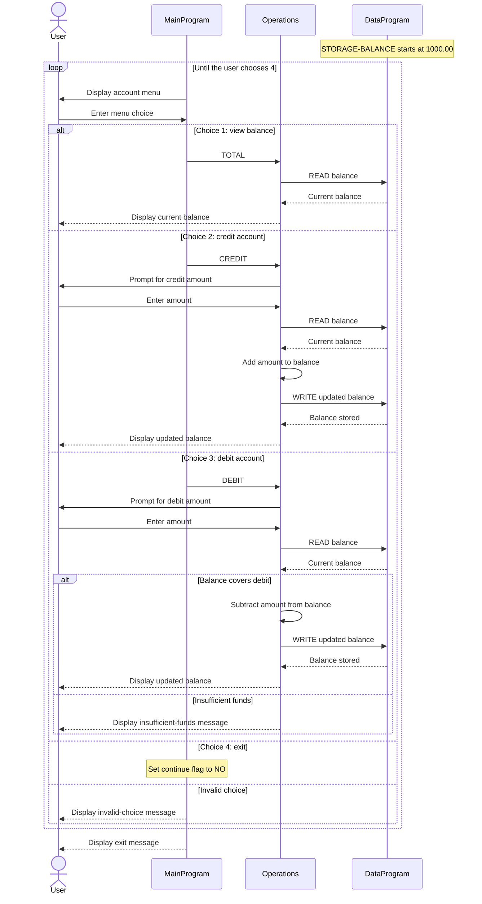

# COBOL Account Management

This directory documents the COBOL account-management example in `src/cobol/`. The program provides a menu to view, credit, and debit one account balance. Although this repository is an exercise about modernizing legacy code, the current COBOL implementation does not identify students or maintain separate accounts per student.

## Source Files

### `main.cob` - `MainProgram`

Runs the interactive menu and dispatches choices to `Operations`:

- `1` requests the current balance (`TOTAL`, padded to six characters in the call).
- `2` requests a credit (`CREDIT`).
- `3` requests a debit (`DEBIT`, padded to six characters in the call).
- `4` exits the program.

Other menu choices display an invalid-choice message. The menu repeats until the user exits.

### `operations.cob` - `Operations`

Implements the account actions. For each action it calls `DataProgram` to read the current balance; credit and successful debit actions write the updated balance back. It prompts for the transaction amount and displays the result.

### `data.cob` - `DataProgram`

Owns the balance value in `STORAGE-BALANCE`, initially `1000.00`. Its procedure accepts an operation and a balance parameter: `READ` copies the stored value to the caller, and `WRITE` replaces the stored value. This storage is held by the running program; no file or database persistence is implemented.

## Account Rules

- The account starts with a balance of `1000.00` each time the program is run.
- Balance and transaction amounts use `PIC 9(6)V99`, allowing up to six whole-number digits and two decimal places. The `V` is an implied decimal point.
- A credit adds the entered amount to the balance.
- A debit is accepted only when the current balance is greater than or equal to the entered amount. Otherwise, the program displays an insufficient-funds message and leaves the balance unchanged.
- There is no explicit validation for zero, negative, malformed, or out-of-range transaction amounts, and no student-specific eligibility, account ownership, or fee rules.
- The implementation maintains a single balance, not individual student accounts, and does not save balances between runs.

## Call Flow

`MainProgram` calls `Operations` with the selected action. `Operations` calls `DataProgram` to read the balance, applies any requested change, and writes successful changes back. The balance is then displayed to the user.

Operation names are passed in six-character fields, with trailing spaces used where needed.

## Sequence Diagram

